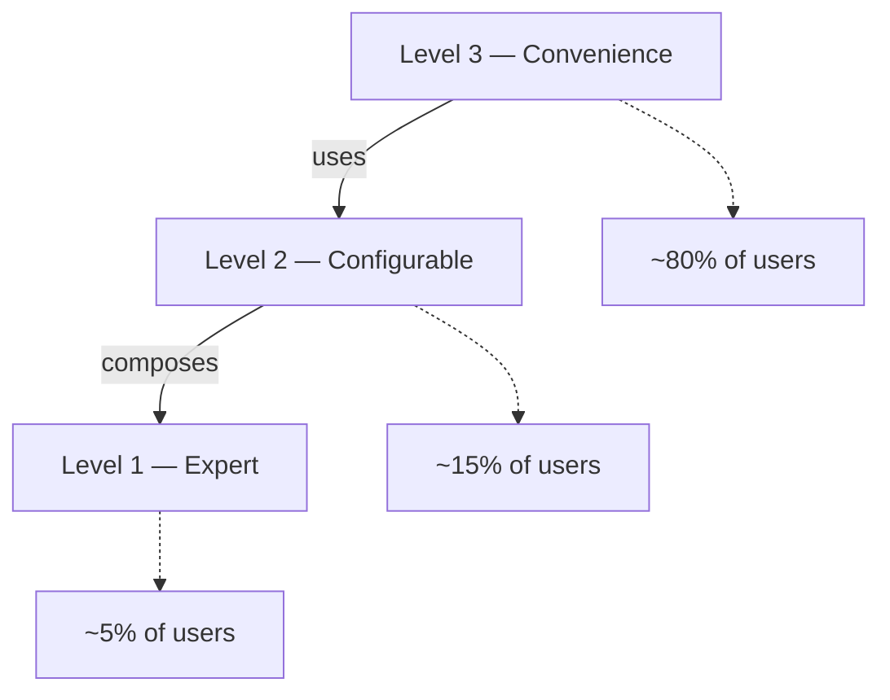

# omni-box Architecture

## Overview

`omni-box` provides reusable primitives for both Transactional Outbox and Transactional Inbox patterns.

- **Outbox**: persist outgoing events in the same DB transaction as the business state change, then publish them asynchronously to a broker.
- **Inbox**: persist incoming broker messages with deduplication, and process them safely with at-most/at-least/exactly-once semantics.

The library is intentionally split into three layers and follows a strict dependency direction: `infra` → `application` → `core`. Nothing inside `core` knows about SQLAlchemy, Kafka, or any specific framework.

## Layers

### Domain layer (`omni_box.core`)

Pure Python, framework-agnostic.

- Models: `BaseEvent`, `OutboxEvent`, `InboxEvent` (Pydantic), `EventStatus`.
- Exceptions: `OmniBoxError`, `StorageError` family, `InboxPersistError`, `UnsupportedCapabilityError`, …
- Protocols (`omni_box.core.protocols`):
  - Repository: `EventRepository[T]`, `OutboxEventRepository`, `InboxEventRepository`, `FetchFilters`, `RepositoryCapabilities`.
  - Capabilities: `SupportsBulkOperations`, `SupportsDistributedLocking`, `SupportsRetentionPolicies`.
  - Broker: `EventPublisher`, `EventConsumer`, `ConsumedMessage`, `AckHandle`, `EnvelopeParser`, `InboxHandler`.
  - Transaction providers: `InboxTransactionProviderProtocol`, `OutboxTransactionProviderProtocol`.
  - Metrics: `InboxMetrics`, `OutboxMetrics`, `ProcessingMetrics`.
- Domain services:
  - `OmniBoxDomainService` — validates and constructs event entities, owns lock/transition logic.
  - `OmniBoxMaintenanceService` — `release_stale_locks`, `cleanup_old_events` (requires `SupportsRetentionPolicies`).
- Pipeline primitives (`omni_box.core.pipeline`):
  - `EventProcessorBuilder` — fluent builder for `EventBatchProcessor`.
  - `ProcessingPipeline`, `ProcessingContext`, `ProcessingStep`, `StepResult`.
  - Built-in steps: `HandlerExecutionStep`, `SiblingDeduplicationStep`, `MetricsStep`, `OpenTelemetryStep`, `CircuitBreakerStep`, `DLQStep`.
  - Strategies:
    - Fetch: `DistributedLockingFetchStrategy`, `OptimisticLockingFetchStrategy`, `FilteredFetchStrategy`.
    - Commit: `BulkCommitStrategy`, `SingleCommitStrategy`.
- Batch engine: `EventBatchProcessor` (`omni_box.core.services.processor`).

### Application layer (`omni_box.application`)

High-level orchestrators and factories that compose domain primitives into ready-to-run services.

- `omni_box.application.services.publish.OutboxPublisher` — high-level outbox publisher. Internally calls `create_outbox_processor` to build an `EventBatchProcessor`.
- `omni_box.application.services.consume.InboxConsumerRunner` — broker consumer with configurable `AckStrategy` and `CommitOffsetPolicy`. It opens transactions through an injected `InboxTransactionProviderProtocol`.
- `omni_box.application.factories`:
  - `create_outbox_processor`
  - `create_inbox_processor`
  - `create_dispatching_processor` (uses `EventRouter`)

### Infrastructure layer (`omni_box.infra`)

Concrete adapters.

- Storage: `omni_box.infra.storage.postgres`
  - Abstract ORM bases: `OutboxEventDBBase`, `InboxEventDBBase`, `OutboxEventPartitionedDBBase`, `InboxEventPartitionedDBBase`, plus mixins (`EventMixin`, `OutboxColumnsMixin`, `InboxColumnsMixin`).
  - Repositories: `PostgresOutboxRepository`, `PostgresInboxRepository`, `PostgresEventRepository`.
- Brokers: `omni_box.infra.brokers.kafka`
  - `KafkaEventPublisher`, `KafkaEventConsumer` built directly on top of `aiokafka` (no extra kits).
- Metrics: `omni_box.infra.metrics` — Prometheus adapters for `InboxMetrics` / `OutboxMetrics`.

## Three Levels of API

1. **Convenience** — `OutboxPublisher`, `InboxConsumerRunner`, and the `create_*_processor` factories. One call gives you a working pipeline.
2. **Configurable** — `EventProcessorBuilder` lets you compose your own pipeline from built-in steps and strategies.
3. **Expert** — implement custom `ProcessingStep`, `FetchStrategy`, or `CommitStrategy` for full control.

## Pipeline at runtime

`EventBatchProcessor.process_batch()` runs four phases per cycle:

1. **Fetch** via the active `FetchStrategy` (distributed locking when the repository supports it, optimistic locking otherwise — auto-selected by `EventProcessorBuilder.build`).
2. **Process** — for each event, run the registered `ProcessingStep`s against a `ProcessingContext` that accumulates completed / failed / skipped IDs.
3. **Commit** — `BulkCommitStrategy` (preferred when the repository implements `SupportsBulkOperations`) or `SingleCommitStrategy`.
4. **Return** a `BatchProcessingResult` (processed IDs, counted/non-counted failures, skipped IDs, `commit_failed` flag).

## Inbox commit semantics

`InboxConsumerRunner` supports three strategies:

- **`AT_MOST_ONCE`** — commit the broker offset *before* attempting to persist. Lost messages on crash; never duplicated.
- **`AT_LEAST_ONCE`** — commit after persistence (`ON_PERSIST`) or after a successful handler (`ON_SUCCESS`).
- **`EXACTLY_ONCE_INBOX`** — commit only after persistence + handler succeed (or when a duplicate is detected). Combined with the inbox unique index on `(message_id, consumer_group)` this yields effectively-once processing.

The `exactly_once_commit_on_failed` flag (default `False`) lets you commit even on handler failure when the message is unrecoverable — useful when you rely on DLQ + maintenance to clean up.

## Session / transaction management

`omni-box` does **not** provide a Unit-of-Work or session implementation. Two integration points are exposed instead:

- For batch processors (outbox/inbox): pass a repository that is already bound to an active session. The processor never starts a transaction; it expects fetch/commit to be transactional inside the repository implementation.
- For `InboxConsumerRunner`: pass an `InboxTransactionProviderProtocol`. The runner calls `provider.transaction()` once per consumed message — the context manager must open a transaction and yield an `InboxEventRepository`.

This keeps the library decoupled from your `AsyncSession`, your UoW, and your DI framework.
